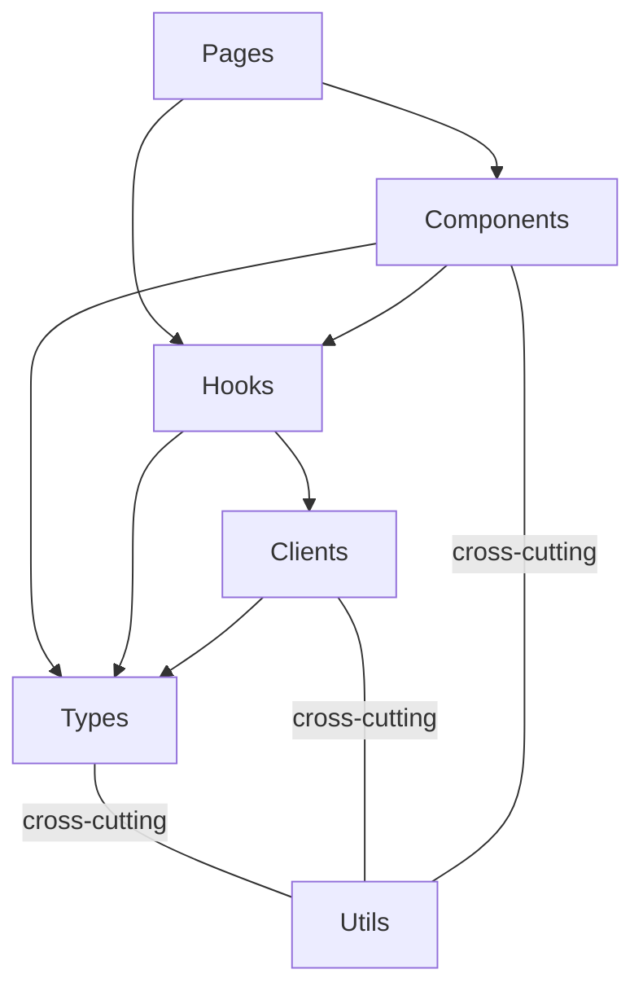

# Architecture — func-console

## Stack

React + TypeScript + PatternFly 6 + OCP Dynamic Plugin SDK

## Layered Architecture

Arrows mean "imports / depends on."

| Layer | Maps to | Depends on |
|-------|---------|------------|
| **Types** | `common/types.ts` | nothing |
| **Clients** | `common/clients/` (plain async functions and hooks that wrap SDK calls) | Types, Utils |
| **Hooks** | `common/clients/use*.ts`, `common/hooks/`, `pages/<name>/hooks/` | Clients, Types, Utils |
| **Components** | `common/components/` (shared), `pages/<name>/components/` (page-specific) | Hooks, Types, Utils |
| **Pages** | `pages/<name>/` | Components, Hooks, Utils |
| **Utils** | `common/utils/` | nothing (cross-cutting) |

### Dependency Rules

- Unidirectional: Types <- Clients <- Hooks <- Components <- Pages
- Utils can be imported by any layer
- Pages and components may import clients and hooks directly
- Clients/hooks never import Components or Pages
- No circular dependencies

### Co-location Convention

- `src/pages/<name>/` contains the page component, its test, and a `components/` subdir
- `src/pages/<name>/components/` contains components used only by that page
- `src/common/` contains everything shared across pages (components, clients, utils, context)
- **Ownership rule:** if a component is imported by only one page (test imports don't count), it lives in `pages/<name>/components/`. If imported by multiple pages, it lives in `common/components/`.

## React

### Pages

- **Smart for page-specific data** -- pages use hooks (their co-located page hook, `useCluster`) to fetch, prepare, and transform all data needed for downstream components.

### Components

- **Simple by default** — they receive data via props, render it, and call callbacks. No logic at the top of a component.
- **May own data when self-contained** -- a component may own its own data and state when it encapsulates a self-contained capability that is not specific to any one page (e.g., auth flows, notification subscriptions). Such components may use hooks directly. The component becomes the single owner of that concern. Pages consume it without orchestrating its internals.
- **Sub-components** — if a sub-component is only used by one parent, keep it in the parent's file, unexported. Extract to its own file only when the sub-component is used by multiple siblings.

### Clients

`common/clients/` contains thin wrappers around external APIs. Two forms:

- **Plain async functions** (e.g., `functionsClient.ts`) -- stateless fetch wrappers that hooks call.
- **Hooks** (e.g., `useCluster.ts`) -- when the client wraps a React-aware SDK call such as `useK8sWatchResource`, it stays as a hook.

### Hooks

- **Extract logic into hooks** — if a page or component has any logic (state management, data transformation, side effects), extract it into a custom hook. If the hook is only used by one component, keep it in the same file, do not export it. If the hook is reused by multiple components within one page, put it in `src/pages/<name>/hooks/`. If reused across pages, put it in `src/common/hooks/`. If there is no logic, no hook is needed.

### Utility Functions

- **Same co-location rule as hooks** — if a utility function is only used by one component or hook, keep it in the same file, do not export it. If it is reused by multiple files within one page, put it in `src/pages/<name>/utils/`. If reused across pages, put it in `src/common/utils/`.

### File Ordering

Within a file, put the exported component at the top, then its hook below, then sub-components, then helper functions at the bottom. Readers see the main thing first and can drill down.

### Performance

- **No speculative memoization**: Do not wrap every function in `useCallback` or every value in `useMemo` as a habit. Use them when there is a concrete reason: a `React.memo` child that depends on a stable reference, or a known re-render path (e.g., a sibling component re-rendering on every keystroke). Plain functions and derived values are the default.

## Architectural Guidance

- PatternFly components preferred over custom HTML
- PatternFly styling and styling rules over custom CSS
- Error handling through ErrorProvider/addError pattern
- Shared utilities in `common/utils/`, not hand-rolled per component
- Clients consumed through hooks, never imported directly

---

## Backend (Go)

### Stack

Go + `net/http` standard library. Key dependencies:

| Dependency | Role |
|---|---|
| `k8s.io/client-go` | Kubernetes API client (SA, RBAC, TokenRequest, kubeconfig) |
| `google/go-github/v90` | GitHub API client |
| `knative.dev/func` | Function scaffold generation |
| `onsi/ginkgo` + `onsi/gomega` | Test framework |

### Packages

| Package | Responsibility |
|---|---|
| `kube` | Shared Kubernetes connection: builds a `*rest.Config` from host/token/caCert (or in-cluster), including the JSON content config and the default request timeout |
| `cluster` | Kubernetes provisioning: service account, RBAC provisioning, TokenRequest, kubeconfig generation |
| `functions` | Function lifecycle via knative/func: cluster queries behind the growable `functions.Client` facade (lists today), plus source/CI scaffold generation (`Generate`) |
| `handler` | HTTP handlers: input validation, orchestration, error mapping |
| `scm` | SCM abstraction types (`Platform`, `Registry`, `Client`) and filesystem helpers |
| `scm/github` | go-github implementation of `scm.Client` |
| `identity` | Who the caller is: turns the console-forwarded user token into an `identity.User` (username + UID) via `SelfSubjectReview`, with a short-lived cache |
| `session` | Session credentials (GitHub PAT today, OAuth later) stored as Secrets in the backend's own namespace, each bound to the `identity.User` that created it |
| `config` | Runtime configuration, package-level wiring vars (`SCMRegistry`), constants, and service account token expiry parsing |
| `tlsreload` | Reloads the serving cert/key from disk on change (fsnotify plus a poll fallback), swapping an atomic `*tls.Certificate` via `GetCertificate` so rotated certs are served without a restart |

### Dependency Rules

- `handler` imports `cluster`, `functions`, `scm`, `config` — never the reverse
- `cluster` and `functions` both import `kube` for connection setup, and have no knowledge of each other
- `kube` imports only `k8s.io/client-go/rest`; it depends on no other backend package
- `cluster` is for provisioning (write RBAC/SA, request tokens); `functions` is for the function lifecycle (list and scaffold generation). Both talk to the cluster but answer different questions, so they stay separate rather than sharing one client interface
- `scm` has no knowledge of cluster or functions
- `functions` imports `scm` only for `scm.Platform` and `scm.FileEntry` types
- `config` is imported by `handler`, `functions`, and `main` only; it owns runtime configuration and package-level wiring
- `identity` is a leaf next to `kube`: it imports `kube` and nothing else from the backend, so `session` and `handler` can both depend on it without a cycle
- `session` imports `identity` because a session is meaningless without the user it belongs to

### Key Decisions

**Cluster access is split by intent: `cluster` (provisioning) vs `functions` (function lifecycle)**
Both talk to the same API server but answer different questions, so they are separate packages rather than one god-client. `cluster` writes RBAC/service accounts and mints tokens; `functions` owns the function lifecycle via knative/func. The shared connection logic lives in `kube.RESTConfig`, which both call, so host resolution, TLS, JSON content config, and the default request timeout are defined once. `kube` is a leaf (depends only on `client-go/rest`), which keeps it importable by any domain package without cycles — unlike `config`, the wiring layer, which is off-limits to domain packages.

**`functions` is the single knative/func facade, but splits offline scaffolding from cluster operations**
Everything that wraps `knative.dev/func` lives in this one package, so there is a single boundary around that dependency. Within it, two responsibilities are kept apart because they have different needs:

- `Generate` (`scaffold.go`) is **offline**: it scaffolds a new function's source and CI files into a temp dir and returns `scm.FileEntry` blobs to push to a repo. It never contacts the cluster and needs no REST config, so it is a plain package function, not a method on `Client`. It is called standalone from the create handler, before any cluster client exists.
- `functions.Client` (`client.go`) is the **cluster-connected** CRUD facade, built via `NewClient(host, token, caCert)` and holding a `*rest.Config`. It exposes `List` today; deploy/undeploy/describe are expected next, hence an interface rather than a bare `Lister`.

`Generate` is deliberately not folded into `Client`: it would ignore the receiver's config entirely, and callers that only scaffold (the create handler) would be forced to build a cluster client with a host and tokens they do not need. Scaffolding produces repo source, not a cluster resource; the cluster-level "create" (deploy) will land on `Client` when it arrives.

**Cluster host resolution: explicit parameter via `--kube-host` flag**
`cluster.New(host, token, caCert)` and `functions.NewClient(...)` accept the API server URL as an explicit parameter and pass it to `kube.RESTConfig`. Empty host triggers `rest.InClusterConfig()` (production pods). In dev, `hack/dev.sh` passes `--kube-host $KUBE_API_SERVER` to the backend binary; in tests, it is passed directly. Env var injection (`KUBERNETES_SERVICE_HOST`) was explicitly rejected as it abuses a Kubernetes-standardized variable and creates hidden ambient state.

**External API URL resolved at Helm install time**
The URL embedded in generated kubeconfigs (`externalAPIServerURL`) comes from the Infrastructure CR (`config.openshift.io/v1/Infrastructure/cluster`) via Helm `lookup` at install time, injected as `--external-api-server-url`. It is not fetched at runtime. This eliminates the need for a `ClusterRole` to query the Infrastructure CR from within the pod.

**Deployment credentials are short-lived and refreshed before file updates**
The backend requests service account tokens with a configurable lifetime, set by `--sa-token-expiry` and defaulting to seven days. When a function is created, its kubeconfig is stored as the `KUBECONFIG` SCM secret and the token expiration timestamp is stored as the `KUBECONFIG_EXPIRE_AT` SCM variable. Before pushing edited files, the handler refreshes both values when the token has 24 hours or less remaining. Missing or malformed expiration metadata also triggers a refresh. Refresh uses the caller's OCP bearer token and the namespace from the repository's `func.yaml`; no cluster credentials are retained by the backend.

**TLS serving certificate reloaded at runtime by an fsnotify + poll hybrid**
The OCP service CA operator rotates the serving cert/key automatically. `tlsreload.Reloader` watches the mounted pair with fsnotify and atomically swaps the cached `*tls.Certificate` served via `tls.Config.GetCertificate`, so a rotation is picked up without restarting the pod. A poll ticker running every 30 seconds operates alongside the watcher as a safety net for events fsnotify can miss, in particular the atomic `..data` symlink swap Kubernetes uses for mounted secrets: when a watched file is removed or renamed the watch is re-added to the new file, and the poll guarantees the change is eventually observed regardless. Polling stays active during watcher setup failures and the 3-second watcher restart delays. Watcher events and poll ticks are processed on one goroutine, so `reload` and its content hash remain serialized and the swap needs only a plain atomic `Store` (no mutex). fsnotify was promoted from an existing indirect dependency; the heavier `k8s.io/apiserver/dynamiccertificates` and `controller-runtime/certwatcher` (which pulls in Prometheus) were avoided. Reloads are content-hashed to skip re-parsing when the pair is unchanged, and the last valid pair is retained when an update is incomplete or invalid.

**Credentials are stored per OpenShift user and found by identity, not by token**

A user's SCM credential lives in one Secret named after a SHA-256 of their identity (the UID where they have one, the username otherwise, prefixed so the two cannot collide). The name is hashed because it is not a secret: it shows up in audit logs and in `oc get secrets` for anyone with read access to the namespace. Connecting again overwrites that Secret rather than adding another, so a user never accumulates live PATs nobody deletes, and revocation has exactly one thing to delete.

`session.Store.GetCredential` takes the caller's `identity.User` as a parameter, so the check cannot be forgotten at a call site; a mismatch is an error, not a flag the caller inspects. Because the Secret is now found by identity rather than named by the token, the token itself is compared against the one issued, in constant time: without that the caller's own token field would be an oracle. The binding written into the Secret is verified on every read rather than inferred from where the Secret was found, since a deleted and recreated account could hash to the same name. There is no `SessionStore` interface: the store has one implementation, and handler tests run against a real `session.Store` over `k8s.io/client-go/kubernetes/fake` so the ownership and expiry rules they exercise are the ones that ship.

Worth being plain about what this does and does not buy. A stolen session token is useless to a different OpenShift user, and the PAT is never in the browser. It is not two independent secrets: `POST /api/v1/auth/session` re-issues a token against the OpenShift token alone, so reaching the console proxy as a given user is enough to obtain their SCM-backed session. That is the cost of not making the user paste their PAT into every new tab, and it was chosen deliberately.

**The credential outlives the session token, so an expiry is recoverable**

Two TTLs, both absolute and neither sliding. `credentialTTL` (24h) caps how long a stored credential can be used before the user supplies it again. `sessionTTL` (1h) is how long one handle stays usable. The shorter one sitting inside the longer one is what makes "the browser lost its token" a different event from "the user lost their credential": the first is repairable, the second is not.

`Store.Reissue` hands a token back to a user who already has a credential stored. An unexpired token is returned **unchanged** rather than rotated, which is not an optimization: two tabs refreshing at once must converge on the same handle, or each would mint its own, invalidate the other's, and the two would refresh each other in a loop.

Three places lean on this:

- `POST /api/v1/auth/session` answers 200 with a working token, or **404** when the user has nothing stored. Not 401: the frontend turns every 401 into "the session is gone" and retries here, so answering 401 would recurse.
- `sessionFetch` catches a 401, resumes once, and retries the failed request exactly once. All callers share one in-flight resume, since a page loading several resources surfaces one expiry as several 401s. `SESSION_EXPIRED_EVENT` fires only when the resume itself fails, which now means the credential is really gone.
- `AuthProvider` resumes on mount when the tab has no token, so a new tab or a reload reconnects silently. Only when there is nothing stored: a resume bumps `connectionId`, and consumers discard their cached data when it changes.

`POST /api/v1/auth/logout` is keyed on the OpenShift user, not on the token. A browser disconnecting with an already-expired handle still expects the credential gone, and a leaked token must not be a way to revoke somebody else's connection. The backend Role therefore needs `update` on secrets alongside `create`, `get`, and `delete`.

The identity comes from the console proxy, which is declared `authorization: UserToken` and forwards the console user's bearer token in `Authorization`. That token is opaque, so `identity.Resolver` asks the API server who it belongs to with a `SelfSubjectReview` (the call behind `oc auth whoami`), which every authenticated user may create; reading `users.user.openshift.io` would need a `ClusterRole` the backend does not have. Answers are cached for an hour, keyed by a SHA-256 of the token, so the lookup costs one round trip per console session rather than one per request. The answer cannot go stale: an `OAuthAccessToken` carries the `userName` and `userUID` it was issued for, and the token string is what names that object, so a given token always means the same person. What the TTL bounds is liveness, not correctness. `Resolve` is the only API server call the GitHub-only routes make (`files`, and `list` when it falls back to repo-only results), so while an entry is cached a revoked console token still redeems its session. The map is pruned on write, which is why entries need to expire at all.

`identity.User` carries both the username and the UID. The UID is the authoritative key where it exists, since a username can be deleted and recreated for a different person while a UID is never reused, but `kube:admin` is backed by a static Secret rather than a `User` object and has none, so `Matches` compares both and falls back to the name alone when neither side has a UID. Two empty users never match, which keeps a session written without a binding from being readable by everybody.

**SCM is abstracted behind a registry**
`scm.Registry` maps `scm.Platform` → `scm.ClientFactory`. The active registry lives at `config.SCMRegistry`, a package-level var that tests swap out via `withSCMMock`. Handlers never reference a concrete SCM client type. The platform is currently resolved statically (`scm.DefaultPlatform = GitHub`), but the registry is designed to support dynamic platform selection — the handler can later derive the platform from the request body or header without changes to the registry or client implementations.

**Handler error mapping**
`createFunction` wraps upstream failures explicitly:

| Error | HTTP status |
|---|---|
| `scm.ErrUnauthorized` | 401 |
| `scm.ErrRepoExists` | 409 |
| `errUpstream` (cluster or SCM failure) | 502 |
| validation failure | 400 |
| internal error | 500 |

**Handlers are stateless**
`Handlers` holds only static configuration, including the requested service account token lifetime. Cluster clients are request-scoped, authenticated with the caller's OCP bearer token, and created only when an operation needs cluster access. There is no shared connection, credential, or session.
